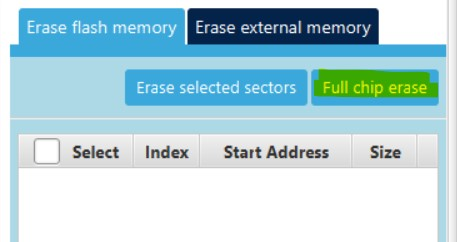
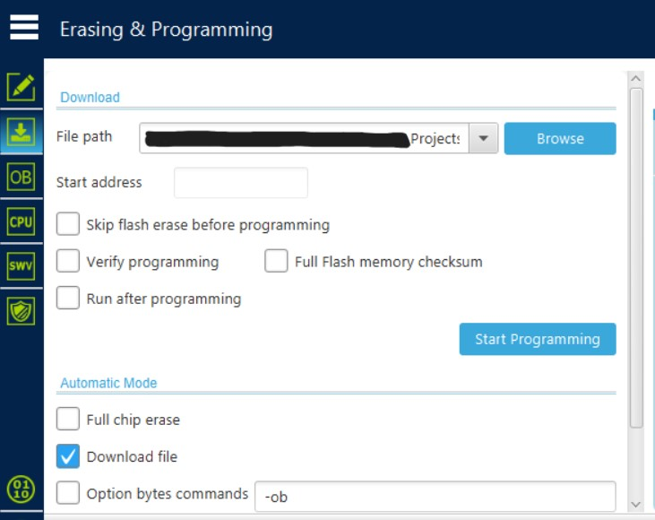
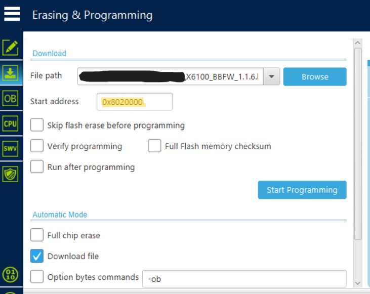

# X6100 Simple Replacement Bootloader

I acquired an X6100 with a bricked STM32 baseband controller. The STM32 still worked, but the firmware and bootloader were both broken/corrupted to the point where none of the baseband functionality worked, and updating the firmware from the radio's UI would always fail.

After a bit of digging, I found the decryption tools for the G90 firmware, and ran them on the X6100 firmware from an SD card image. I was able to flash the firmware to the STM32, and tell the chip to start running from the correct memory location, but this meant that any time I wanted to use the radio, it had to be tethered to a computer, as disconnecting the ST-Link would reset the chip, and there was nothing to tell it to jump to the correct memory address.

This bootloader simply loads up at 0x8000000 and jumps to 0x8020000 (where the main application resides).

There is no firmware flashing mechanism built in just yet, so it requires you to flash the bootloader, then the application, manually.

## Build Instructions
I used [PlatformIO](https://platformio.org) to develop and build the bootloader. 

Install it [via your preferred method](https://platformio.org/install/ide).

Once PlatformIO is installed, go to the root of the bootloader directory (where this file, as well as the platformio.ini file is located), and execute ``` pio run ```
PlatformIO will then download the tools required to compile the bootloader, compile it, then spit out the file as ``` .pio/build/armstrap_eagle1024/firmware.elf ```.

## Flashing the bootloader
All of the following steps should be done with the **radio plugged in to external power**. Connect an external battery, or your regular battery charger, otherwise you will have to hold the power button the entire time to power the STM32.

### Prepare the chip
If your STM32 is the original, you will need to disable the readout protection option bytes 

***WARNING: Disabling readout protection will wipe the chip and you will lose any firmware or bootloader already programmed in***

Once compiled (or if using the pre-compiled .elf file provided), You will need to run [STM32CubeProgrammer](https://www.st.com/en/development-tools/stm32cubeprog.html) to flash both the bootloader, as well as the decrypted baseband firmware.

Just to make sure, do a full chip erase in STM32CubeProgrammer



### Bootloader flash


Load the bootloader .elf file (that you either compiled, or the pre-compiled one [here](./x6100-simple-bootloader.elf)), make sure the start address field is empty (it is built-in to the elf file), uncheck all the boxes, then hit ```Start Programming```

The bootloader should program in without issue.

### Application flash


Browse to and find the decrypted baseband firmware (not provided here) of your choosing, set the Start Address to ```0x8020000```, make sure all of the options are unchecked, and hit ```Start Programming```.

This will program the firmware into the correct location, without erasing the bootloader.

## Testing
Once everything is programmed in, unplug the ST-Link, unplug from external power, and hold the power button until you see the boot logo. You should now be able to let go of the power button, and the radio should stay powered on.

If, when you let go of the power button on battery power, the radio turns off completely, something went wrong... Do a full chip erase, and try again.

## Notes and To-Do:
This bootloader does not support loading new firmwares either via usb, serial, or the radio UI.

In order to load a newer firmware, the firmware must be decrypted, and loaded in manually via the ST-Link, using the above steps.

This bootloader does not use any code developed by the original manufacturer of the radio.

### TODO
- [ ] Add serial bootload support
- [ ] Add support for bootloading from the UI
- [ ] Add support for decrypting firmware loaded from the UI (as the original bootloader does)
- [ ] Try to find out if the original bootloader does any other initialization of the chip before loading the application.
